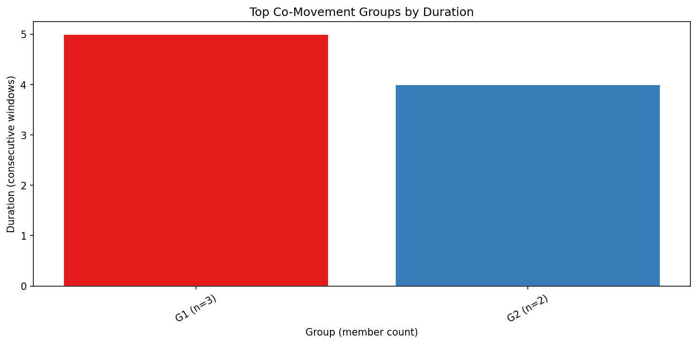
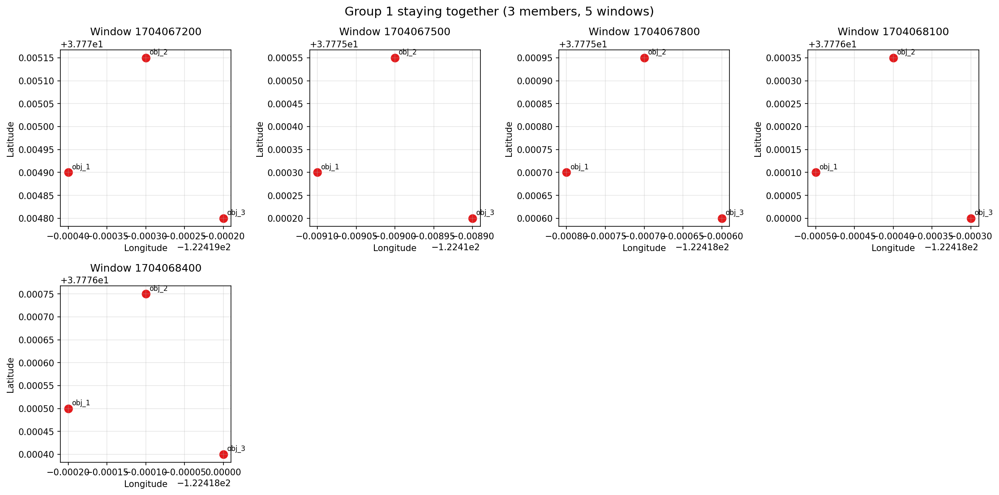

# Group-Pattern-Miner

Find groups of objects that move together in trajectory data.

The input should be a pandas DataFrame or CSV with these columns:

```text
object_id,timestamp,lat,lon
```

This matches the cleaned output format from Urban-Movement-Explorer.

## What It Does

The project looks for objects that stay close to each other across multiple
time windows. A group is counted as a co-movement pattern only when the same
members stay together for a minimum number of consecutive windows.

The sample data finds two groups:

| Group | Members | Duration |
| --- | --- | ---: |
| Group 1 | obj_1, obj_2, obj_3 | 5 windows |
| Group 2 | obj_4, obj_5 | 4 windows |

## Output

Interactive map:

[results/group_trajectories_map.html](results/group_trajectories_map.html)

Top groups by duration:



Snapshot sequence:



## How It Works

1. `window.py` snaps timestamps into fixed-size windows.
2. `proximity.py` finds nearby object pairs in each window.
3. `grouping.py` merges nearby pairs into groups and keeps groups that persist.
4. `visualize.py` saves the map and charts.

For speed, the proximity step uses a grid. Objects are placed into local meter
cells, and the code only compares objects in the same or neighboring cells.
This avoids checking every possible pair while still using haversine distance
for the final meter-based threshold.

## Parameters

Defaults are in `src/config.py`.

| Parameter | Default |
| --- | ---: |
| `window_size_seconds` | 300 |
| `distance_threshold_meters` | 100.0 |
| `min_duration_windows` | 3 |

## Run It

Install dependencies:

```bash
python3 -m pip install -r requirements.txt
```

Run the sample:

```bash
python3 run.py
```

Run tests:

```bash
python3 -m unittest discover -s tests -v
```

Use your own CSV:

```bash
python3 run.py --input path/to/trajectories.csv --results results
```

## Project Structure

```text
data/
src/
results/
tests/
run.py
requirements.txt
README.md
.gitignore
```

## Dependencies

- pandas
- numpy
- folium
- matplotlib
